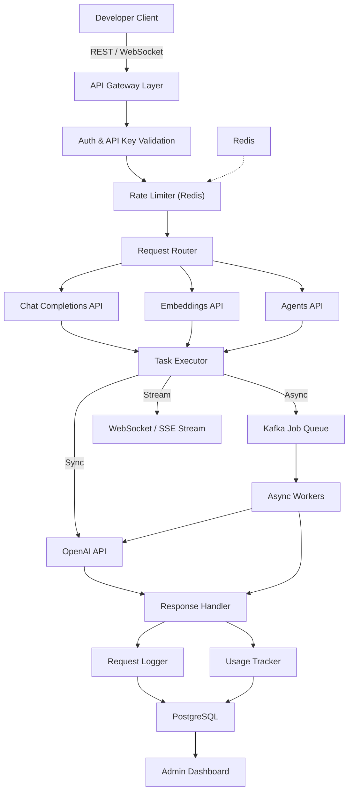

# Developer API Platform for AI Workflows

A clean, scalable API platform that enables developers to integrate AI workflows (chat, embeddings, agents) into their applications. 

This platform handles request validation, routing, execution, streaming, async jobs, rate limiting, usage tracking, logging, and monitoring.

## Tech Stack

- **API Framework**: Python (FastAPI)
- **Database**: PostgreSQL (async pg)
- **Cache & Rate Limiting**: Redis
- **Message Queue**: Kafka (async jobs)
- **AI Provider**: OpenAI API
- **Containerization**: Docker & Docker Compose
- **Protocols**: REST & WebSockets (streaming)

## Architecture Diagram



## Quick Start (Local Development)

### 1. Prerequisites
- Docker and Docker Compose
- Node.js (optional, if frontend is added later)

### 2. Environment Setup
Copy the example environment variables:
```bash
cp .env.example .env
```
Add your `OPENAI_API_KEY` in the `.env` file.

### 3. Run the Platform
Start all services (App, PostgreSQL, Redis, Kafka, Zookeeper) using Docker Compose:
```bash
docker compose up --build -d
```

### 4. Verify Services
Check the health endpoint:
```bash
curl http://localhost:8000/health
# {"status": "healthy", "version": "1.0.0"}
```

View the interactive API documentation (Swagger UI):
- http://localhost:8000/docs
